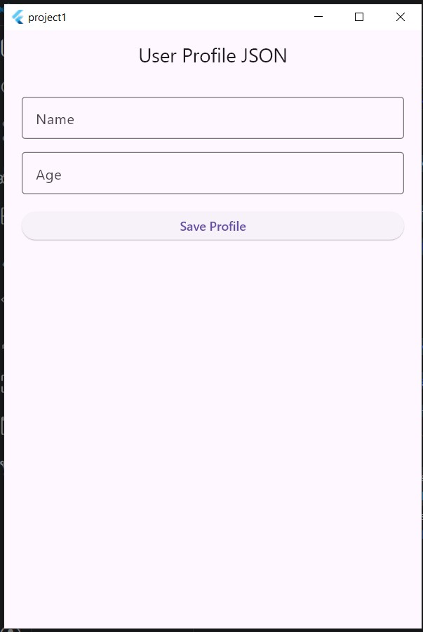
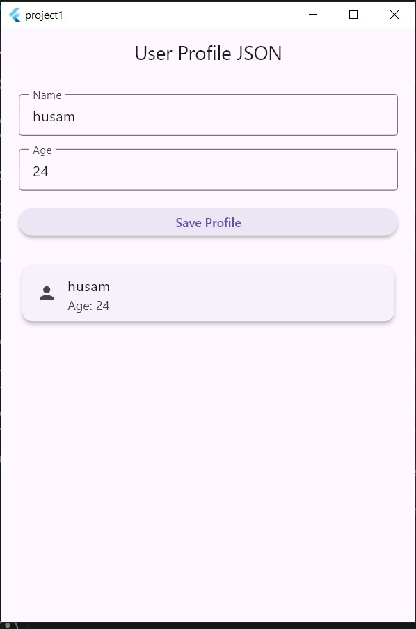

# User Profile JSON App

A simple Flutter application that demonstrates saving and loading user profile data using JSON and local File I/O.

---

## Project Description

This app allows the user to enter a name and age, then save the profile data as JSON in a local file.

When the app starts again, it reads the saved JSON file and displays the saved profile automatically.

This project demonstrates:

- JSON encoding
- JSON decoding
- File write
- File read
- Persistent local data

---

## Technologies Used

- Flutter
- Dart
- Path Provider
- JSON
- File I/O

---

## Project Screenshots

### Empty Profile Form

### Saved Profile

---

## Features

- Enter user name
- Enter user age
- Save profile as JSON
- Read saved profile on startup
- Display saved profile in a card
- Show success message after saving
- Handle errors using try/catch

---

## File I/O Flow

User enters name and age
        ↓
Press Save Profile
        ↓
Convert object to JSON
        ↓
Write JSON to profile.json
        ↓
Restart app
        ↓
Read profile.json
        ↓
Convert JSON back to object
        ↓
Display saved profile
---

## JSON Example

{
  "name": "husam",
  "age": 24
}
---

## Code Concepts Used

### Convert Object to JSON

Map<String, dynamic> toJson() {
  return {
    'name': name,
    'age': age,
  };
}
### Convert JSON to Object

factory UserProfile.fromJson(Map<String, dynamic> json) {
  return UserProfile(
    name: json['name'],
    age: json['age'],
  );
}
### Save File

await file.writeAsString(jsonString);
### Read File

final content = await file.readAsString();
---

## Author

Husam Dirhem